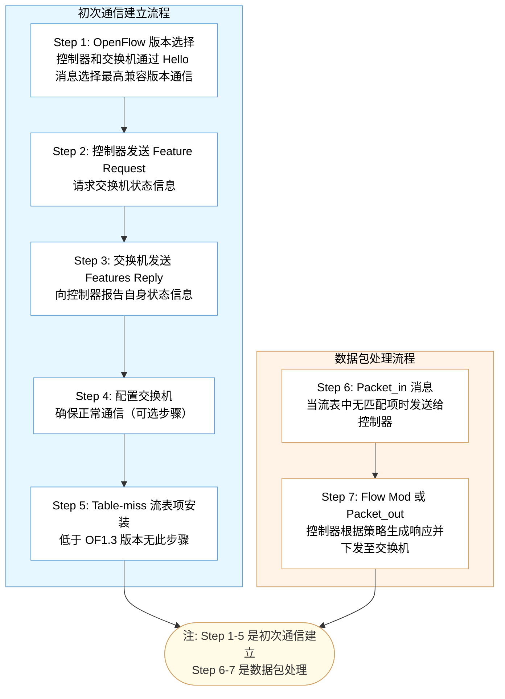

```mermaid
flowchart TD
    %% 定义步骤节点
    Step1[Step 1: OpenFlow 版本选择<br/>控制器和交换机通过 Hello 消息选择最高兼容版本通信]
    Step2[Step 2: 控制器发送 Feature Request<br/>请求交换机状态信息]
    Step3[Step 3: 交换机发送 Features Reply<br/>向控制器报告自身状态信息]
    Step4[Step 4: 配置交换机<br/>确保正常通信（可选步骤）]
    Step5[Step 5: Table-miss 流表项安装<br/>低于 OF1.3 版本无此步骤]
    Step6[Step 6: Packet_in 消息<br/>当流表中无匹配项时发送给控制器]
    Step7[Step 7: Flow Mod 或 Packet_out<br/>控制器根据策略生成响应并下发至交换机]

    %% 定义分组和关系
    subgraph 初次通信建立流程
        direction TB
        Step1 --> Step2 --> Step3 --> Step4 --> Step5
    end

    subgraph 数据包处理流程
        direction TB
        Step6 --> Step7
    end

    %% 额外说明
    Note1([注: Step 1-5 是初次通信建立<br/>Step 6-7 是数据包处理])
    Step5 --> Note1
    Step7 --> Note1

    %% 样式美化
    style 初次通信建立流程 fill:#E6F7FF,stroke:#66A1D2,stroke-width:1px,color:#000
    style 数据包处理流程 fill:#FFF2E6,stroke:#D2A166,stroke-width:1px,color:#000

    style Step1 fill:#FFFFFF,stroke:#66A1D2,stroke-width:1px,color:#000
    style Step2 fill:#FFFFFF,stroke:#66A1D2,stroke-width:1px,color:#000
    style Step3 fill:#FFFFFF,stroke:#66A1D2,stroke-width:1px,color:#000
    style Step4 fill:#FFFFFF,stroke:#66A1D2,stroke-width:1px,color:#000
    style Step5 fill:#FFFFFF,stroke:#66A1D2,stroke-width:1px,color:#000
    style Step6 fill:#FFFFFF,stroke:#D2A166,stroke-width:1px,color:#000
    style Step7 fill:#FFFFFF,stroke:#D2A166,stroke-width:1px,color:#000

    style Note1 fill:#FFFBE6,stroke:#D2A166,stroke-width:1px

```